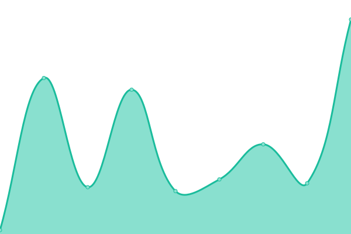
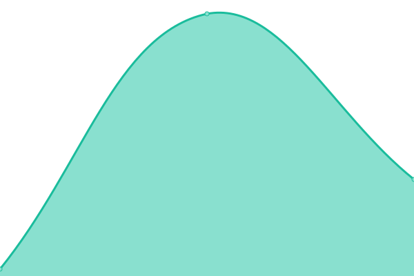

# [📈 Live Status](https://upptime.github.io/upptime): <!--live status--> **🟧 Partial outage**

This repository contains the open-source uptime monitor and status page for [Upptime](https://upptime.js.org), powered by [Upptime](https://github.com/upptime/upptime).

With [Upptime](https://upptime.js.org), you can get your own unlimited and free uptime monitor and status page, powered entirely by a GitHub repository. We use [Issues](https://github.com/upptime/upptime/issues) as incident reports, [Actions](https://github.com/upptime/upptime/actions) as uptime monitors, and [Pages](https://upptime.github.io/upptime) for the status page.

<!--start: status pages-->
<!-- This summary is generated by Upptime (https://github.com/upptime/upptime) -->
<!-- Do not edit this manually, your changes will be overwritten -->
<!-- prettier-ignore -->
| URL | Status | History | Response Time | Uptime |
| --- | ------ | ------- | ------------- | ------ |
|  [Streamline](https://streamline.thedsi.company/) | 🟩 Up | [streamline.yml](https://github.com/DamSimm/infinity-status/commits/HEAD/history/streamline.yml) | 

 817ms
     
 | 

<a href="https://upptime.github.io/upptime/history/streamline">100.00%</a>
    

|  [Minecraft](apex02.coaxium.infinityand.co) | 🟩 Up | [minecraft.yml](https://github.com/DamSimm/infinity-status/commits/HEAD/history/minecraft.yml) | 

 40ms
     
 | 

<a href="https://upptime.github.io/upptime/history/minecraft">5.44%</a>
    

|  [Coaxium](apex02.coaxium.infinityand.co) | 🟩 Up | [coaxium.yml](https://github.com/DamSimm/infinity-status/commits/HEAD/history/coaxium.yml) | 

 38ms
     
 | 

<a href="https://upptime.github.io/upptime/history/coaxium">5.28%</a>
    

|  [Imperialis](apex01.imperialis.infinityand.co) | 🟥 Down | [imperialis.yml](https://github.com/DamSimm/infinity-status/commits/HEAD/history/imperialis.yml) | 

 0ms
     
 | 

<a href="https://upptime.github.io/upptime/history/imperialis">0.04%</a>
    

<!--end: status pages-->

[**Visit our status website →**](https://upptime.github.io/upptime)

## 📄 License

- Powered by: [Upptime](https://github.com/upptime/upptime)
- Code: [MIT](./LICENSE) © [Anand Chowdhary](https://anandchowdhary.com), supported by [Pabio](https://pabio.com)
- Data in the `./history` directory: [Open Database License](https://opendatacommons.org/licenses/odbl/1-0/)
